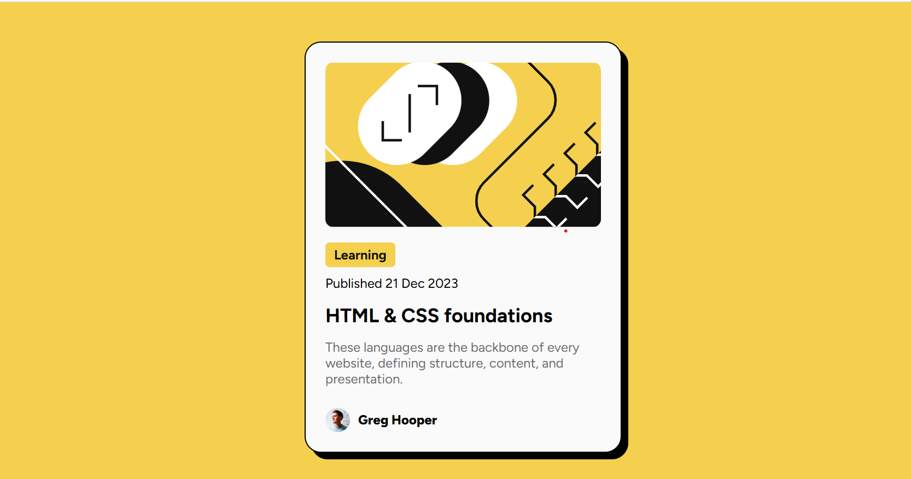

# Frontend Mentor - Blog preview card solution

This is a solution to the [Blog preview card challenge on Frontend Mentor](https://www.frontendmentor.io/challenges/blog-preview-card-ckPaj01IcS). Frontend Mentor challenges help you improve your coding skills by building realistic projects. 

## Table of contents

- [Overview](#overview)
  - [The challenge](#the-challenge)
  - [Screenshot](#screenshot)
- [My process](#my-process)
  - [Built with](#built-with)
  - [What I learned](#what-i-learned)
  - [Continued development](#continued-development)
- [Author](#author)

## Overview

### The challenge

Users should be able to:

- See hover and focus states for all interactive elements on the page

### Screenshot

## My process

### Built with

- Semantic HTML5 markup
- CSS custom properties
- Flexbox

### What I learned

The max-width and min-width properties in CSS are used to define constraints on the width of an element. These properties are essential for creating flexible and responsive layouts.  

When to use max-width?
- Prevent an element from growing too large on large screens.
- Control the width of images or text in responsive designs.
- Ensure that the design doesn't look broken if the viewport is too wide.

When to use min-width?
- Prevent elements like buttons or boxes from collapsing and becoming too small.
- Maintain a functional layout on smaller screens.
- Ensure content is always readable.

These properties are very useful for making responsive designs and if we combine them with min-content we get a good result. That's how I did this project.

Use the min-content property for the card. This is so that on large screens the card only takes up the necessary width without overflowing the content.

### Continued development

I would like to continue working on responsive design because in the design images, the desktop version compared to the mobile version are identical, almost the same, just smaller.

Personally, the desktop version was not difficult for me, but making the mobile version was. And even more so if you want them to look identical.

## Author
- Frontend Mentor - [Osvaldo Valdivia](https://www.frontendmentor.io/profile/progValji)

